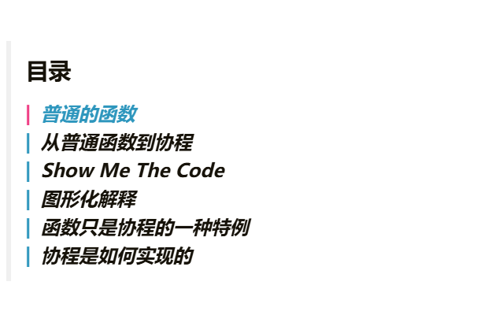

# 主题文档 - Hugo液态玻璃效果


参考[Liquid Glass](https://codepen.io/Mikhail-Bespalov/pen/MYwrMNy)实现的液态玻璃效果。

## 存放svg效果

将[Liquid Glass](https://codepen.io/Mikhail-Bespalov/pen/MYwrMNy)中的svg效果存放在./layouts/partials/Liquid Glass.html之中。

这样以便后续在_custom.scss之中使用。

## 修改成液态玻璃效果

以TOC目录为例子，这这是原本TOC目录的样式



TOC目录在scss中的选择器是`#toc-auto`，那么要修改以下元素,代码如下。

```scss
/* 应用于 LoveIt 主题的侧边栏 TOC 和文章内 TOC */
.toc-auto, 
#toc-auto,
.post-toc,
#toc-static {
  /* 设置半透明背景和边框，增加质感 */
  background: rgba(255, 255, 255, 0.08) !important;
  border: 2px solid transparent;
  border-radius: 16px !important;
  padding: 15px !important;
  
  /* 阴影效果 */
  box-shadow: 0 0 0 2px rgba(255, 255, 255, 0.6), 0 16px 32px rgba(0, 0, 0, 0.12) !important;

  /* 核心：调用 SVG 液态玻璃滤镜 */
  backdrop-filter: url(#frosted) blur(5px) !important;
  -webkit-backdrop-filter: url(#frosted) blur(5px) !important;

}

/* 暗黑模式适应 (Hugo LoveIt 支持 dark mode) */
[theme=dark] .toc-auto, 
[theme=dark] #toc-auto,
[theme=dark] .post-toc,
[theme=dark] #toc-static {
  border: 2px solid transparent;
  box-shadow: 0 0 0 2px rgba(0, 0, 0, 0.3), 0 16px 32px rgba(255, 255, 255, 0.06) !important;

}

/* 优化 TOC 内部链接样式 */
.toc-auto a, #toc-auto a, .post-toc a {
  text-shadow: 0 1px 2px rgba(0,0,0,0.1);
}
```

这样我们就能获得到液态玻璃效果的TOC目录了。其它的组件也可以套用这种效果核心就在于SVG的液态玻璃滤镜。

