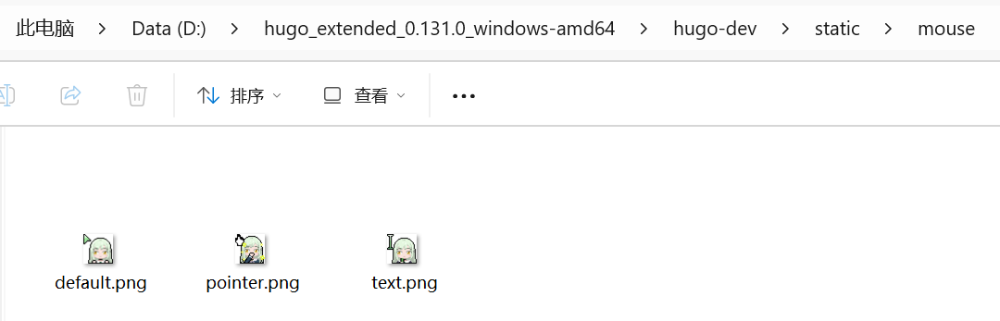
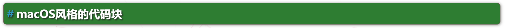

# 主题文档 - Hugo美化


# 前言

本博客使用的是Hugo的LoveIt主题，本文也是基于该主题而写的，不过Hugo的美化步骤应该大同小异，版本如下：

```bash
hugo: v0.131.0/extended windows/amd64 BuildDate: unknown

LoveIt: v0.3.1
```

**请注意，本文的所有功能都离不开两个新增加的文件：`_custom.scss`和`custom.js`，部分功能还需要`jquery`。**

## 添加自定义的_custom.scss

LoveIt主题提供了一个自定义的`_custom.scss`，可以在该文件里添加自定义的css样式。该文件目录位于`\themes\LoveIt\assets\css\_custom.scss`，不建议直接在该文件里写css代码。

Hugo在渲染页面时优先读取站点根目录下的同名字的目录和文件，所以可以利用这个特点来美化主题。**只需要把想修改的主题模板文件拷贝到根目录下同样的目录中并进行修改，这样就可以在不改动原本的主题文件的情况下实现主题美化。**

首先在站点根目录下创建一个自定义的文件：`\assets\css\_custom.scss`，这样Hugo就会最终以该文件来渲染页面的样式。

> 注意！！！

这里有个很关键的点，只有使用的是扩展版本的Hugo，才能令`_custom.scss`文件生效！！！因为原生的Hugo并不支持编译sass文件，必须使用扩展版本的Hugo才行。

所以请查看你所使用的Hugo版本，如果不是`hugo_extended`版本，请前往[Hugo Release页面](https://github.com/gohugoio/hugo/releases)下载你当前版本Hugo所对应的`hugo_extended`版本。

比如我原本使用的是`hugo_0.131.0_Windows-64bit.zip`，就需要改为使用`hugo_extended_0.131.0_Windows-64bit.zip`。

此外，本文会涉及多个文件的修改，包括hmtl、js、scss等文件类型，且由于**引入了中文字符**，可能导致页面**显示乱码**，这是因为文件的编码使用的是`ANSI`，**需要改为`UTF-8`的编码**。

## 添加自定义的custom.js

LoveIt主题并没有提供一个文件来让我们自定义JavaScript，所以需要自己创建一个js文件来自定义JavaScript。

首先在站点根目录下创建一个自定义的JavaScript文件：`\static\js\custom.js`。这个文件需要在body的闭合标签之前引入，并且要在`theme.min.js`的引入顺序之后。这样可以防止样式被其他文件覆盖，并且不会因为JavaScript文件加载太久导致页面长时间的空白。

对于LoveIt主题，`custom.js`添加在`\themes\LoveIt\layouts\partials\assets.html`里。

首先把该文件拷贝到根目录下的`\layouts\partials\assets.html`，然后打开拷贝后的文件，把自定义的JavaScript文件添加到最末尾的`{{- partial "plugin/analytics.html" . -}}`的上一行：

```html
{{- /* 自定义的js文件 */ -}}
<script type="text/javascript" src="/js/custom.js"></script>
```

由于本文提及的部分功能会用到jQuery，建议一起引入，最终如下：

```bash
<script type="text/javascript" src="https://cdn.jsdelivr.net/npm/jquery@2.1.3/dist/jquery.min.js"></script>

{{- /* 自定义的js文件 */ -}}
<script type="text/javascript" src="/js/custom.js"></script>

```

## 修改鼠标样式

* (1) 准备好鼠标样式图片(默认，指针，文本…)，图片大小建议控制在 **32px** 左右，将图片放入`static/mouse`文件夹下(文件夹自己创建)



- (2) 修改`assets/css/_custom.scss`(文件不存在则自己创建)，将以下代码复制进去，根据主题按实际情况填写对应的css选择器

```scss
// ==============================
// Custom style
// 自定义样式
// ==============================
/* ===== 自定义鼠标光标（LoveIt + 纯 PNG）===== */

// 1. 默认光标
body,
.single .content,
.home .home-profile {
  cursor: url("/mouse/default.png") 5 5, auto;
}

// 2. 指针光标（链接、按钮）
a:hover,
button:hover,
.theme-switch,
.header .menu .menu-item a:hover {
  cursor: url("/mouse/pointer.png") 5 5, pointer;
}

// 3. 文本光标（输入框、正文）
input,
textarea,
.single .content p,
.single .content li {
  cursor: url("/mouse/text.png") 5 5, text;
}
```

## macOS风格的代码块

* 准备一张macOS代码块的[**红绿灯图片**](./macOS-code-header.svg)(Ctrl+S保存), 放到`static/icons`文件夹下
* 将以下代码复制进`assets/css/_custom.scss`文件中(不存在则自行创建)

```scss
/* ===== macOS 风格代码块 ===== */

.highlight {
  border-radius: var(--card-border-radius);
  max-width: 100% !important;
  margin: 1rem 0 !important;
  box-shadow: var(--shadow-l1) !important;
  overflow: hidden;
}

// 隐藏 LoveIt 原生的代码块头部（包含语言名称和复制按钮）
.highlight .code-header {
  display: none !important;
}
// 用伪元素生成 macOS 圆点条
.highlight:before {
  content: "";
  display: block;
  background: url(/icons/macOS-code-header.svg) no-repeat 12px center;
  background-size: 48px 12px;
  height: 28px;
  background-color: var(--code-bg, #f6f8fa);
  border-bottom: 1px solid var(--border-color, #e1e8ed);
}
```

## 文章 H2 标题

* 修改H2标题样式如图



```scss
/*h2 标题 */
.page.single h2 {
    box-shadow: rgb(95, 90, 75) 0px 0px 0px 1px, rgba(10, 10, 0, 0.5) 1px 1px 6px 1px;
    color: rgb(255, 255, 255);
    font-family: 微软雅黑, 宋体, 黑体, Arial;
    font-weight: bold;
    line-height: 1.3;
    text-shadow: rgb(34, 34, 34) 2px 2px 3px;
    background: rgb(46, 125, 50);
    border-radius: 6px;
    border-width: initial;
    border-style: none;
    border-color: initial;
    border-image: initial;
    padding: 7px;
    margin: 18px 0px 18px -5px !important;
}
```

* 暗黑模式修改

```scss
/* 暗黑模式  */
[theme=dark] .page.single h2 {
  background: rgb(27, 94, 32);           /* 暗黑下用更深的绿 */
  color: #e8f5e9;                         /* 文字微微偏绿白，柔和 */
  box-shadow: rgb(20, 50, 20) 0px 0px 0px 1px, rgba(0, 0, 0, 0.6) 1px 1px 6px 1px;
}
```


